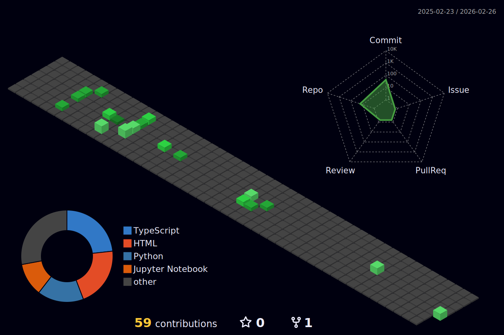

<div align="center">

```
╔══════════════════════════════════════════════════════════════════╗
║                                                                  ║
║   ██╗  ██╗███████╗██╗     ██╗      ██████╗                      ║
║   ██║  ██║██╔════╝██║     ██║     ██╔═══██╗                     ║
║   ███████║█████╗  ██║     ██║     ██║   ██║                     ║
║   ██╔══██║██╔══╝  ██║     ██║     ██║   ██║                     ║
║   ██║  ██║███████╗███████╗███████╗╚██████╔╝                     ║
║   ╚═╝  ╚═╝╚══════╝╚══════╝╚══════╝ ╚═════╝                     ║
║                                                                  ║
║          I ' M    M J  .    W E L C O M E  ! !                   ║
║                                                                  ║
╚══════════════════════════════════════════════════════════════════╝
```

<br>

```
▄▄▄▄▄▄▄▄▄▄▄▄▄▄▄▄▄▄▄▄▄▄▄▄▄▄▄▄▄▄▄▄▄▄▄▄▄▄▄▄▄
█                                           █
█   ◄ SELECT YOUR CLASS ►                  █
█                                           █
█   ⚔️  Backend Developer    ████████░░ 80% █
█   🔮  Data Engineer        ██████░░░░ 60% █
█   📱  Mobile Developer     █████░░░░░ 50% █
█   🧪  ML Explorer          ████░░░░░░ 40% █
█                                           █
▀▀▀▀▀▀▀▀▀▀▀▀▀▀▀▀▀▀▀▀▀▀▀▀▀▀▀▀▀▀▀▀▀▀▀▀▀▀▀▀▀
```

</div>

---

<div align="center">

### `⚡ SKILL TREE ⚡`

```
                    ┌─────────────┐
                    │  LANGUAGES  │
                    └──────┬──────┘
           ┌───────────────┼───────────────┐
           ▼               ▼               ▼
     ┌───────────┐  ┌───────────┐  ┌───────────┐
     │   Java    │  │  Python   │  │  Kotlin   │
     │  ★★★★☆   │  │  ★★★★☆   │  │  ★★★☆☆   │
     └───────────┘  └───────────┘  └───────────┘
           ┌───────────────┼───────────────┐
           ▼               ▼               ▼
     ┌───────────┐  ┌───────────┐  ┌───────────┐
     │JavaScript │  │TypeScript │  │    SQL    │
     │  ★★★☆☆   │  │  ★★★☆☆   │  │  ★★★★☆   │
     └───────────┘  └───────────┘  └───────────┘
```

</div>

<div align="center">

#### `>> EQUIPPED ITEMS <<`


</div>

---

<div align="center">

### `🏰 DUNGEON STATUS 🏰`

<br>


<br><br>


</div>

---

<div align="center">

### `🗺️ 3D WORLD MAP 🗺️`

<br>



</div>

---

<div align="center">

### `🏆 ACHIEVEMENTS UNLOCKED 🏆`

<br>


</div>

---

<div align="center">

```
╔══════════════════════════════════════════╗
║                                          ║
║   GAME OVER?  NO, JUST GETTING STARTED.  ║
║                                          ║
║          ► CONTINUE                      ║
║            NEW GAME                      ║
║                                          ║
╚══════════════════════════════════════════╝
```


</div>
